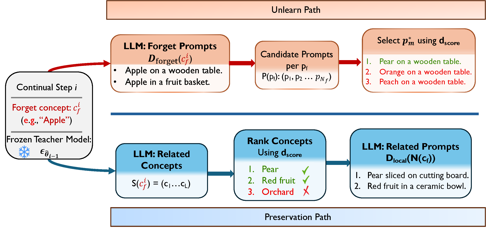
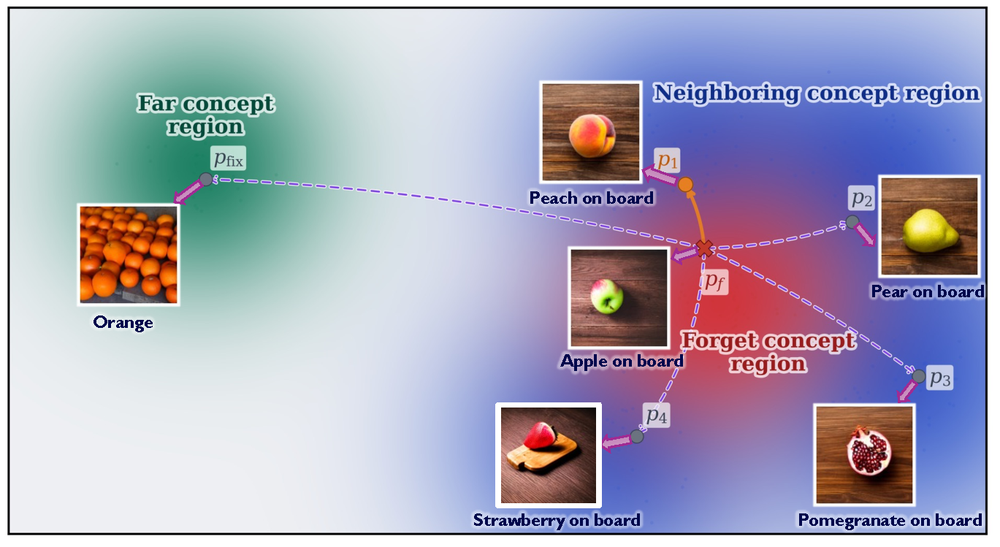

<div align="center">

# [ECCV 2026] Locality-Aware Continual Unlearning for Diffusion Models

[Naveen George](https://ngk2110.github.io) | [Naoki Murata](https://ai.sony/people/Naoki-Murata/) | [Yuhta Takida](https://ai.sony/people/yuhta-takida) | [Konda Reddy Mopuri](https://krmopuri.github.io/) | [Yuki Mitsufuji](https://www.yukimitsufuji.com)

[Paper](https://arxiv.org/abs/2512.02657)

</div>

LACU is a continual unlearning framework for text-to-image diffusion models.
It removes concepts one after another while trying to preserve nearby and
unrelated concepts.

The core idea is locality. Instead of mapping every forget prompt to one fixed
generic target, LACU asks the current diffusion model which safe replacement is
closest to the original prompt in score-prediction space. It also protects
nearby retain concepts with local replay. This is important in continual
unlearning because damage to neighboring concepts compounds across deletion
steps.

<div align="center">
  
  <br>
  <sub>LACU builds a local unlearn path and a local preservation path at each continual step.</sub>
</div>

## Quick Start

To run LACU you need to start with these commands:

```bash
git clone https://github.com/SonyResearch/LACU.git
cd LACU
```

Create the training environment:

```bash
conda env create -f ldm_environment.yml
conda activate lacu-train
```

Create the evaluation environment:

```bash
conda env create -f qwenvl_environment.yml
conda activate lacu-eval
```

Run the released 10-step Stable Diffusion v1.5 sequence:

```bash
conda activate lacu-train
./train.sh
```

Evaluate a checkpoint:

```bash
conda activate lacu-eval
./evaluate_checkpoint.sh outputs/lacu_sd15_10/10_mickey_mouse/checkpoints/step_350
```

The scripts download model weights from Hugging Face when a model id such as
`runwayml/stable-diffusion-v1-5` is used. The released prompt cache starts from
the scoring inputs, so `train.sh` regenerates `map_model.csv` and
`related_score.txt` for the current checkpoint before unlearning each concept.
Set `OPENAI_API_KEY` because retain-prompt generation uses the OpenAI API after
trajectory scoring:

```bash
export OPENAI_API_KEY=...
```

## What Happens In One LACU Step

For each concept, LACU uses three prompt paths:

1. `forget_prompts_path`: prompts that contain the concept to remove.
2. `map_prompts_path`: aligned safe mapping prompts selected for those
   forget prompts.
3. `retain_prompts_path`: local replay prompts for nearby concepts that should
   be preserved.

During each unlearning step, `train.py` loads the current checkpoint as a frozen
teacher and a student UNet to update. The student is optimized with three
losses:

- `lambda_unlearn`: makes the student prediction for a forget prompt match the
  teacher prediction for the selected mapping prompt.
- `lambda_preserve`: distills the teacher on locally related retain prompts, so
  nearby concepts are not damaged.
- `lambda_reg`: adds lightweight L2 parameter regularization against the
  previous checkpoint to reduce cumulative drift.

LACU avoids fixed anchors, such as an empty prompt or one generic replacement,
because they can force large score-prediction changes. Those changes hurt
semantically close concepts first, and the effect accumulates when many
concepts are removed sequentially.

## Continual Unlearning

The release runner uses these 10 concepts:

```text
pikachu, brad_pitt, golf_ball, van_gogh_style, apple,
spiderman, lionel_messi, cartoon_style, banana, mickey_mouse
```

`train.sh` unlearns them in order. After each concept, the final checkpoint from
that step becomes the input model for the next step:

```text
BASE_MODEL
  -> outputs/lacu_sd15_10/01_pikachu/checkpoints/step_250
  -> outputs/lacu_sd15_10/02_brad_pitt/checkpoints/step_250
  -> ...
  -> outputs/lacu_sd15_10/10_mickey_mouse/checkpoints/step_350
```

Useful overrides:

```bash
BASE_MODEL=runwayml/stable-diffusion-v1-5 \
OUTPUT_ROOT=outputs/lacu_sd15_10 \
ACCELERATE_NUM_PROCESSES=3 \
TRAIN_BATCH_SIZE=18 \
GRADIENT_ACCUMULATION_STEPS=2 \
./train.sh
```

The final checkpoint path is printed at the end of the run. A completed concept
is skipped if its final checkpoint directory already exists. If a partial output
directory exists, the script exits instead of overwriting it; use a new
`OUTPUT_ROOT` or move the partial directory aside.

## Paths And Variables

The shell scripts compute `SCRIPT_DIR` from their own location. This means the
default paths point inside the `LACU/` repository even if you call the script
from another directory. You can still pass absolute paths when you want outputs
or prompts somewhere else.

### Unlearning Variables

| Variable | Default | Meaning |
| --- | --- | --- |
| `BASE_MODEL` | `runwayml/stable-diffusion-v1-5` | Initial model for step 1. Can be a Hugging Face model id or a local Diffusers checkpoint folder. Later steps use the previous step checkpoint automatically. |
| `OUTPUT_ROOT` | `LACU/outputs/lacu_sd15_10` | Root folder for all unlearned checkpoints. Each concept gets a subfolder such as `01_pikachu/`. |
| `PROMPTS_ROOT` | `LACU/prompts` | Root folder containing one prompt-cache folder per concept. |
| `OPENAI_MODEL` | `gpt-4o-mini` | OpenAI model used when generating missing prompt assets or writing retain prompts after retain-concept scoring. |
| `OPENAI_API_KEY` | unset | - |
| `ACCELERATE_NUM_PROCESSES` | `3` | Number of Accelerate processes, usually the number of GPUs. The recommended LACU setting is 3 GPUs. |
| `MIXED_PRECISION` | `fp16` | Precision mode passed to Accelerate. Use `bf16` if your hardware and environment support it. |
| `TRAIN_BATCH_SIZE` | `18` | Per-process unlearning batch size, so this is the batch size per GPU. |
| `GRADIENT_ACCUMULATION_STEPS` | `2` | Number of batches accumulated before one optimizer update. Effective batch size is `ACCELERATE_NUM_PROCESSES * TRAIN_BATCH_SIZE * GRADIENT_ACCUMULATION_STEPS`. |
| `LR_SCHEDULER` | `constant_with_warmup` | Scheduler passed to Diffusers `get_scheduler`. |
| `T_MAX` | `600` | Maximum diffusion timestep sampled for the unlearning loss. Timesteps are sampled uniformly from `[0, T_MAX]`. |
| `MAP_K` | `32` | Number of latent/timestep samples used when score-ranking mapping candidates. |
| `RETAIN_K` | `16` | Number of latent/timestep samples used when score-ranking local retain concepts. |

The per-concept values for steps, learning rates, warmup steps, and loss weights
are arrays inside `train.sh`: `STEPS`, `LRS`, `WARMUPS`, `LAMBDA_UNLEARN`,
`LAMBDA_PRESERVE`, and `LAMBDA_REG`.

The default unlearning configuration uses 3 GPUs with effective batch size
`3 * 18 * 2 = 108`. This is the recommended setting for reproducing the LACU
runs. If you run on fewer or smaller GPUs, including 48 GB cards, reduce
`TRAIN_BATCH_SIZE` and compensate with `GRADIENT_ACCUMULATION_STEPS`, but very
small per-device batches can make it hard to reproduce the same numbers even
when the effective batch size is similar.

### Evaluation Variables

| Variable | Default | Meaning |
| --- | --- | --- |
| `MODEL_FOLDER` | first script argument | Diffusers checkpoint folder to evaluate. |
| `PROMPTS_CSV` | `LACU/prompts/eval.csv` | Base evaluation CSV with `concept,prompt` columns. |
| `PROMPTS_EXTRA_ROOT` | `LACU/prompts` | Folder searched for each concept's `val.csv`; these are merged into evaluation prompts. |
| `OUTPUT_ROOT` | `LACU/eval_outputs/<checkpoint-name>` | Evaluation output folder. |
| `GPU` | `0` | GPU id for image generation and CLIP scoring. |
| `NUM_IMAGES_PER_PROMPT` | `8` | Images generated for each prompt. |
| `BATCH_SIZE` | `64` | CLIP scoring batch size. |
| `VLM_BATCH_SIZE` | `32` | Qwen2.5-VL classification batch size. |
| `GEN_PROMPT_BATCH` | `16` | Number of prompts sent through generation at once. |
| `SAVE_WORKERS` | `6` | Worker count for image saving. |

## Method

<div align="center">
  
  <br>
  <sub>Locality-aware target selection chooses nearby safe prompts in the model score-prediction space.</sub>
</div>

LACU uses score-prediction distance as the model-aware notion of closeness. In
practice, the current diffusion model denoises the same noisy latent at the same
timestep under two different text prompts. If the predicted noise is similar,
the prompts are close in the model's own representation.

This distance is used twice:

- Locality-aware target selection: for every forget prompt, generate candidate
  safe replacements and choose the nearest safe replacement.
- Locality-aware replay: find related retain concepts that are close to the
  forget concept and replay them during distillation.

This is why the mapping and retain files are tied to the model/checkpoint used
for scoring. If you change `BASE_MODEL` substantially, use a new `PROMPTS_ROOT`
or regenerate the score-selected files for best reproducibility.

## Prompt Files

Prompt assets for the released concepts are already stored under
`prompts/`. For example:

```text
prompts/pikachu/
  train.csv              forget prompts used for unlearning
  val.csv                validation prompts merged into evaluation
  candidates_clip.json   candidate safe replacements generated by LLM + CLIP filtering
  related_concepts.txt   candidate retain concepts before trajectory scoring
```

Each stored per-concept file is an input to unlearning, scoring, or
evaluation:

| File | Used for |
| --- | --- |
| `train.csv` | Required forget prompts. These are the unlearning prompts passed to `train.py`. |
| `candidates_clip.json` | Required to start mapping from the scoring step. `model_score_map_gen.py` scores these candidates with the current diffusion model and generates `map_model.csv`. |
| `related_concepts.txt` | Required to start retain generation from the scoring step. `retain_prompt_gen.py` scores these concepts by diffusion trajectory similarity and then generates `related_score.txt`. |
| `val.csv` | Used by evaluation as extra concept-specific prompts. |

`map_model.csv` and `related_score.txt` are generated outputs tied to the
checkpoint used for scoring. `train.sh` regenerates both before calling
`train.py` for each concept, even if previous copies exist. Existing
`related_concepts.txt` files are reused as the concept pool, then the
trajectory-ranked retain prompts are refreshed for the current checkpoint.

For a new concept, create a folder under `prompts/` using the slugged concept
name, such as `prompts/batman/`. The setup flow is:

1. Generate `train.csv` and `val.csv` with `prompt_gen.py`.
2. Generate `candidates_clip.json` with `clip_map_gen.py --save_candidates`.
3. Generate `map_model.csv` with `model_score_map_gen.py`.
4. Generate `related_score.txt` with `retain_prompt_gen.py`. If
   `related_concepts.txt` is already present, the script starts from
   trajectory scoring; otherwise it first asks the LLM for related concepts.
5. Add the concept name and per-concept hyperparameters to the arrays in
   `train.sh`.

The LLM-dependent steps require `OPENAI_API_KEY`. Mapping score selection
(`model_score_map_gen.py`) uses the diffusion model and does not call OpenAI.
Retain generation (`retain_prompt_gen.py`) uses both diffusion trajectory
scoring and the OpenAI API: scoring selects the related concepts, then the LLM
writes retain prompts for the selected concepts.

### Regenerating Mapping Files

`map_model.csv` is generated from `candidates_clip.json`, not directly from
`train.csv`. The candidate file is produced by `clip_map_gen.py`: for each
forget prompt it asks the LLM for safe replacement candidates, filters/ranks
them with CLIP, and saves the full candidate set when `--save_candidates` is
used. Then `model_score_map_gen.py` loads `candidates_clip.json`, scores the
candidates with the current diffusion model, and writes the final
`map_model.csv`.

Use this when you want to rebuild mappings for a concept:

```bash
python clip_map_gen.py \
  --concept pikachu \
  --prompts_root prompts \
  --save_candidates

python model_score_map_gen.py \
  --mode discrete \
  --concept pikachu \
  --model_path runwayml/stable-diffusion-v1-5 \
  --prompts_root prompts
```

If `candidates_clip.json` already exists, you can skip `clip_map_gen.py` and run
only `model_score_map_gen.py`. `train.sh` does this automatically for every
concept/checkpoint pair because the score-selected target depends on the
diffusion model used for scoring.

### Regenerating Retain Prompts

`related_score.txt` is generated by `retain_prompt_gen.py`. When
`related_concepts.txt` already exists, the script skips related-concept
discovery, filters those concepts, ranks them by diffusion trajectory
similarity, and asks the LLM to write retain prompts for the top-ranked related
concepts. The final trajectory-ranked prompts are saved to `related_score.txt`.

The default `train.sh` call uses `--skip_clip`, so retain selection is based on
diffusion trajectory scoring rather than CLIP ranking. It removes stale
`related_score.txt` and `related_concepts_score_top10.txt` before calling
`retain_prompt_gen.py`, which lets the script reuse `related_concepts.txt`
but refresh the model-dependent ranking and prompts. Run this manually to
regenerate the retained prompts for one concept:

```bash
python retain_prompt_gen.py \
  --concept pikachu \
  --model_path runwayml/stable-diffusion-v1-5 \
  --prompts_root prompts \
  --skip_clip
```

### Regenerating Forget And Validation Prompts

`train.csv` and `val.csv` are generated together by `prompt_gen.py`:

```bash
python prompt_gen.py \
  --concept "pikachu" \
  --task mapped \
  --n 100 \
  --out_root prompts
```

## Evaluation

Evaluate a single Diffusers checkpoint folder:

```bash
conda activate lacu-eval
./evaluate_checkpoint.sh outputs/lacu_sd15_10/10_mickey_mouse/checkpoints/step_350
```

Useful overrides:

```bash
PROMPTS_CSV=prompts/eval.csv \
PROMPTS_EXTRA_ROOT=prompts \
OUTPUT_ROOT=eval_outputs/mickey_mouse_step_350 \
GPU=0 \
NUM_IMAGES_PER_PROMPT=8 \
./evaluate_checkpoint.sh /path/to/diffusers/checkpoint
```

The evaluator generates images, computes CLIP scores, and runs Qwen2.5-VL yes/no
classification with confusables-aware prompts. It writes per-concept
`metrics.csv` files plus a top-level `summary.csv` under `OUTPUT_ROOT`.

## Qualitative Results

<div align="center">
  
</div>

## Key Files

- `train.sh`: 10-concept continual unlearning runner.
- `train.py`: LACU unlearning loop and loss wiring.
- `losses.py`: unlearning, preservation, and parameter-regularization losses.
- `prompt_gen.py`: forget and validation prompt generation.
- `clip_map_gen.py`: candidate safe mapping prompt generation.
- `model_score_map_gen.py`: score-prediction mapping selection.
- `retain_prompt_gen.py`: local retain/replay prompt generation.
- `evaluate_checkpoint.sh`: single-checkpoint evaluation wrapper.
- `eval.py`: image generation, CLIP scoring, and Qwen2.5-VL evaluation.
- `prompts/`: cached prompt, mapping, retain, and evaluation assets.

## Citation

```bibtex
@inproceedings{george2026locality,
  title={Locality-Aware Continual Unlearning for Diffusion Models},
  author={George, Naveen and Murata, Naoki and Takida, Yuhta and Mopuri, Konda Reddy and Mitsufuji, Yuki},
  booktitle={European Conference on Computer Vision (ECCV)},
  year={2026},
  organization={Springer}
}
```
